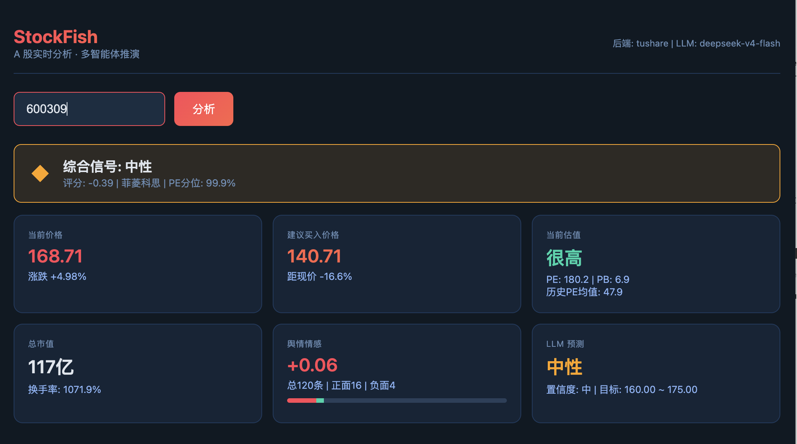
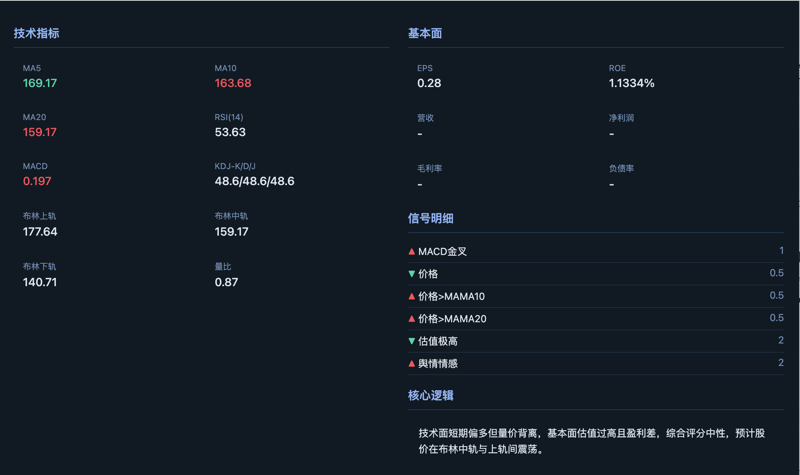
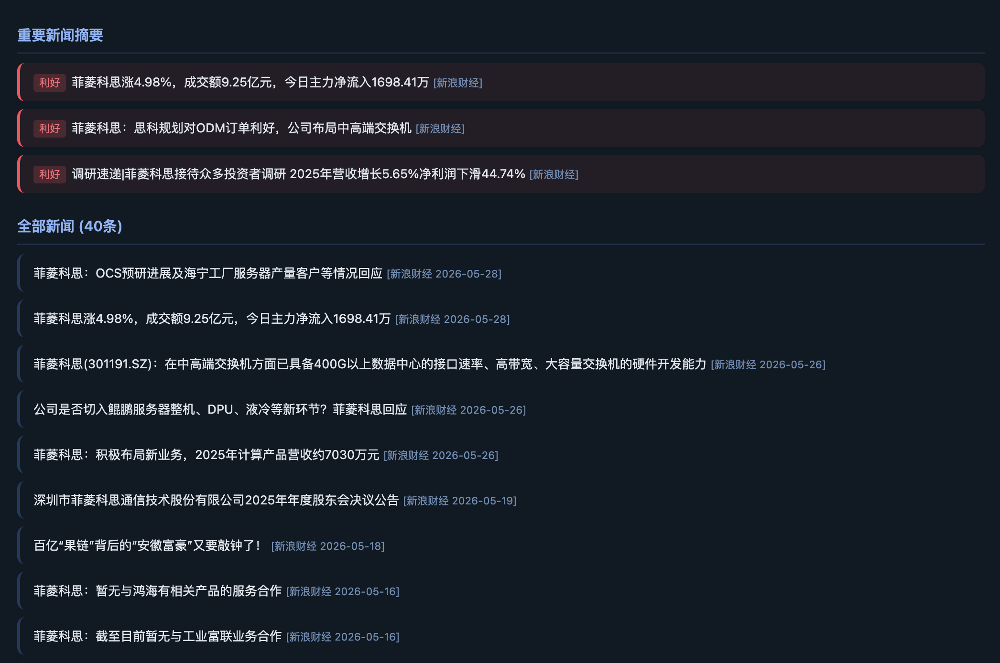
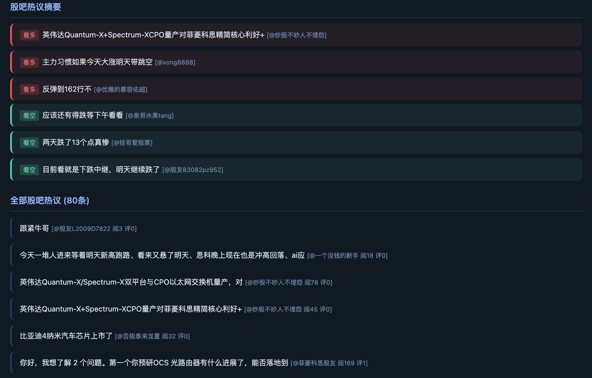
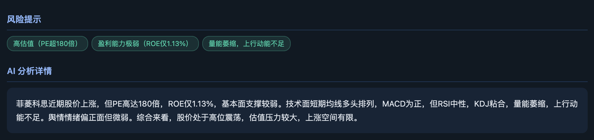

# StockFish — A 股智能分析 + 股价推演系统

A 股多因子分析引擎：行情采集 → 情感计算 → 估值评估 → 信号生成 → LLM 预测，支持 MiroFish OASIS 群体智能模拟推演。

## 架构

```
POST /api/analyze
  │
  ├─ Step 1: 数据采集
  │   ├─ Tushare Pro  → 行情 / 历史K线 / 历史PE / 基本面
  │   ├─ 新浪财经      → 个股新闻 (当日40条)
  │   └─ 东方财富股吧  → 帖子热点 (当日80+条)
  │
  ├─ Step 2: 情感分析
  │   └─ 关键词匹配 → 正面/负面/中性 → 利好利空摘要提取
  │
  ├─ Step 3: 估值 + 信号生成
  │   ├─ PE 3年历史分位 → 很低/偏低/正常/偏高/很高
  │   ├─ 建议买入价 ← PE均值回归 + 布林下轨支撑
  │   └─ 加权评分 ← RSI/MACD/KDJ/均线/布林/估值/舆情
  │
  ├─ Step 4: LLM 综合预测
  │   └─ deepseek-v4-flash → 展望/置信度/目标价/风险点
  │
  └─ Step 5: 前端渲染
      └─ 6卡片 + 技术/基本面 + 新闻/股吧摘要 (A股红涨绿跌)
```

### 预测推演链路

```
/api/predict (异步)
  │
  ├─ 分析 (同上) → 种子文档生成
  ├─ MiroFish OASIS 模拟 (可选, HTTP桥接)
  └─ HTML 预测报告输出 → reports/
```

## 快速开始

### 1. 配置

```bash
cp .env.example .env
# 编辑 .env，填入 API Key
```

必需：

| 变量 | 说明 |
|------|------|
| `TUSHARE_TOKEN` | Tushare Pro 数据令牌 |
| `LLM_API_KEY` | DeepSeek / OpenAI 兼容 API Key |
| `LLM_BASE_URL` | API 地址 (如 `https://api.deepseek.com`) |
| `LLM_MODEL_NAME` | 模型名 (如 `deepseek-v4-flash`) |
| `STOCK_BACKEND` | 数据后端：`tushare` / `akshare` / `mock` |

可选：

| 变量 | 说明 |
|------|------|
| `ZEP_API_KEY` | MiroFish 图记忆 (Zep Cloud) |
| `MIROFISH_HOST` | MiroFish 服务地址 |

### 2. 安装依赖

```bash
pip install -r requirements.txt
```

### 3. 启动

```bash
# 本地模式
bash run.sh --local

# Docker 模式
bash run.sh

# Docker (跳过 MiroFish)
bash run.sh --no-mirofish
```

访问 `http://localhost:8000`

### 4. API 示例

```bash
# 多因子分析
curl -X POST http://localhost:8000/api/analyze \
  -H 'Content-Type: application/json' \
  -d '{"symbol":"600519"}'

# 股价推演
curl -X POST http://localhost:8000/api/predict \
  -H 'Content-Type: application/json' \
  -d '{"symbol":"600519","scenario":"base"}'
```

## 界面展示

<p align="center">
  
  
</p>

<p align="center">
  
  
</p>

<p align="center">
  
</p>

配色采用 A 股传统：**红涨绿跌**。

## 目录结构

```
StockFish/
├── app.py                     # Flask 主入口 / API 路由 / SSE
├── config.py                  # pydantic-settings 全局配置
├── run.sh                     # 一键部署 (Docker/本地)
├── docker-compose.yml         # StockFish + MiroFish 编排
├── requirements.txt
├── static/index.html          # 单页前端
│
├── market_data/               # 数据层
│   ├── a_stock_provider.py    # 主入口 + Mock/AkShare/Sina/EastMoney 后端
│   ├── tushare_provider.py    # Tushare Pro 后端 (行情/历史/PE/财务)
│   └── sentiment_collector.py # 情感分析器 (关键词 + 模型降级)
│
├── analysis/                  # 分析引擎
│   ├── agent.py               # 5步管线主控
│   ├── state/state.py         # 分析状态定义
│   └── nodes/prediction_node.py # LLM/规则预测节点
│
├── simulation_bridge/         # MiroFish 桥接层
│   ├── orchestrator.py        # 模拟编排器
│   └── seed_builder.py        # 种子文档构建
│
├── prediction_report/         # 报告生成
│   └── report_generator.py    # HTML/JSON 报告
│
├── sxsc_tushare/              # 山西证券 Tushare 封装
└── reports/                   # 输出: 预测报告
```

## 引用

- [Tushare Pro](https://tushare.pro/) — A 股数据接口
- [DeepSeek](https://api.deepseek.com) — LLM 推理
- [BettaFish](https://github.com/freenowill/BettaFish) — 多智能体舆情分析
- [MiroFish](https://github.com/freenowill/MiroFish) — OASIS 群体智能模拟引擎
- [qlib-zh](https://github.com/microsoft/qlib) — 量化因子参考
- [AkShare](https://github.com/akfamily/akshare) — 金融数据接口
