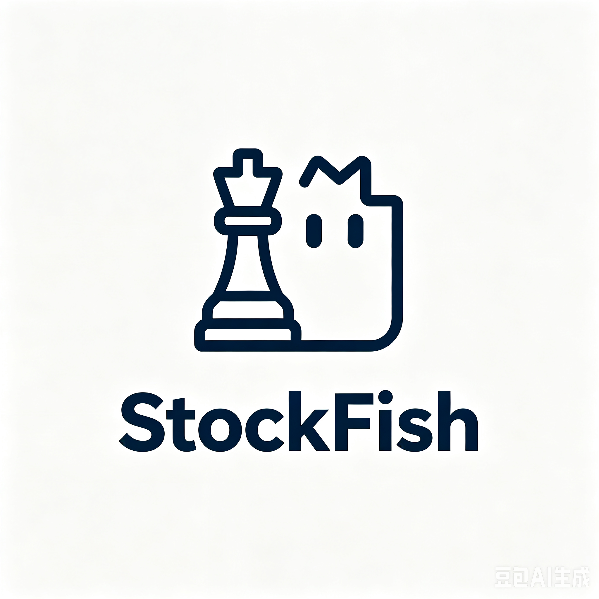
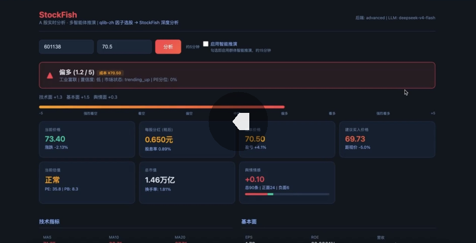
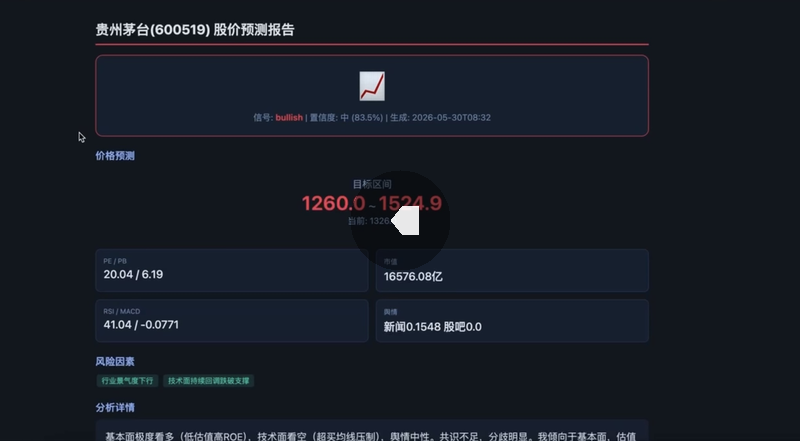
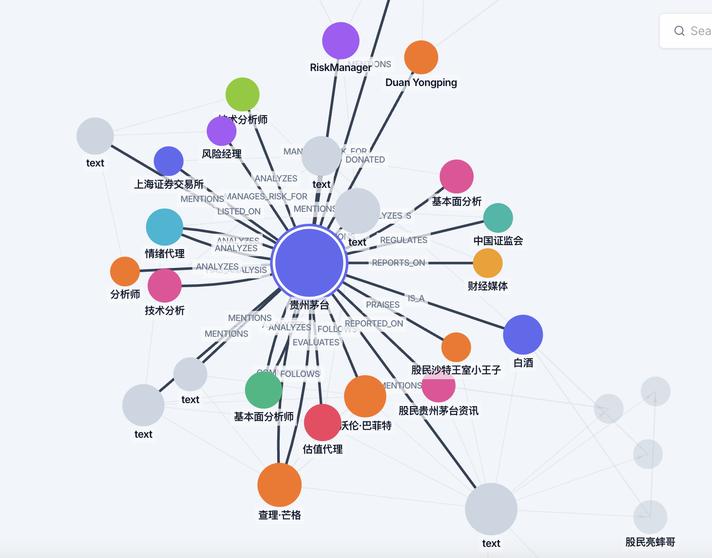

<p align="center">
  
</p>

# StockFish — A 股智能分析 + 股价推演系统

### 完整决策链路

<p align="center">
  
</p>

### StockFish 多因子分析引擎

<p align="center">
  
</p>

## 🎬 Demo 演示

<table>
<tr>
<td align="center" width="50%">
  <a href="https://b23.tv/5etEKuw">
    
  </a>
  <br><b>📊 基础分析模式</b>
  <br>StockFish 多因子分析（本地模式）
</td>
<td align="center" width="50%">
  <a href="https://b23.tv/AJChmUb">
    
  </a>
  <br><b>🧠 智能推演模式</b>
  <br>StockFish + MiroFish OASIS 群体智能推演
</td>
</tr>
</table>

### 🧠 智能推演知识图谱

<p align="center">
  
</p>

> MiroFish OASIS 引擎构建的群体智能知识图谱：7 种 Agent 角色（Buffett/Munger/估值/情绪/基本面/技术面/风控）在模拟社交网络中交互推演，Zep GraphRAG 提取实体关系，形成多维度股价预测推理网络。

---

## 📦 Docker 部署（推荐）

使用预构建的 Docker 镜像，无需手动安装依赖。

### 前置条件

- Docker & Docker Compose
- `.env` 配置文件（见下方）

### 一键启动

```bash
bash run.sh
```

脚本自动完成：
1. 拉取 `zhuhai123/stockfish-stockfish:latest` + `zhuhai123/stockfish-mirofish:latest`
2. 将项目代码挂载到容器内，启动两个服务
3. 等待服务就绪

> **镜像只提供运行环境**（Python 包、Node.js、camel-ai 等），应用代码来自项目文件挂载。
> 修改代码后执行 `docker compose up -d` 重建容器即可生效，无需重新构建镜像。

### 其他模式

```bash
bash run.sh --local          # 本地 Python 直接运行（无需 Docker）
bash run.sh --no-mirofish    # Docker 部署，仅启动 StockFish
```

### 访问服务

| 服务 | 地址 |
|------|------|
| StockFish 前端 | http://localhost:8000 |
| MiroFish 前端 | http://localhost:3000 |
| MiroFish API | http://localhost:5001 |

### 管理命令

```bash
docker compose logs -f stockfish    # 查看日志
docker compose logs -f mirofish     # 查看 MiroFish 日志
docker compose down                 # 停止服务
docker compose pull                 # 更新到最新镜像
```

---

## 🚀 快速开始

### 1. 配置 `.env`

```bash
cp .env.example .env
# 编辑 .env，填入 API Key
```

**必需变量：**

| 变量 | 说明 |
|------|------|
| `LLM_API_KEY` | DeepSeek / OpenAI 兼容 API Key |
| `LLM_BASE_URL` | API 地址（如 `https://api.deepseek.com`） |
| `LLM_MODEL_NAME` | 模型名（如 `deepseek-v4-flash`） |
| `STOCK_BACKEND` | 数据后端：`advanced` / `tushare` / `akshare` / `mock` |

**数据源（`STOCK_BACKEND=advanced` 时自动启用，支持一个或多个搜索引擎，配置任一即可）：**

| 变量 | 说明 |
|------|------|
| `TUSHARE_TOKEN` | Tushare Pro 数据令牌（sxsc_tushare 代理） |
| `TAVILY_API_KEY` | Tavily 搜索引擎 Key（新闻搜索） |
| `BOCHA_API_KEY` | 博查搜索 Key（中文新闻，推荐） |
| `BRAVE_API_KEY` | Brave Search Key |
| `SERPAPI_API_KEY` | SerpAPI（Google）Key |
| `FINNHUB_API_KEY` | Finnhub 美股数据 |
| `LONGBRIDGE_APP_KEY` 等 | 长桥 OpenAPI 港美股 |
| `SOCIAL_SENTIMENT_API_KEY` | 美股社交情感（Reddit/X/Polymarket） |

**可选：**

| 变量 | 说明 |
|------|------|
| `ZEP_API_KEY` | MiroFish 图记忆（Zep Cloud） |
| `MIROFISH_HOST` | MiroFish 服务地址（Docker 内默认 `mirofish`） |
| `EFINANCE_CALL_TIMEOUT` | 东方财富超时秒数（默认30，境外建议5） |
| `SEARXNG_PUBLIC_INSTANCES_ENABLED` | SearXNG 公共实例（境外建议 `false`） |
| `YFINANCE_PRIORITY` | yfinance 优先级（境外建议 `0`，最快） |

### 2. 安装依赖（本地模式）

```bash
pip install -r requirements.txt
```

### 3. 启动

```bash
# Docker 模式（默认）
bash run.sh

# 本地模式
bash run.sh --local

# Docker（跳过 MiroFish）
bash run.sh --no-mirofish
```

### 4. API 示例

```bash
# 多因子分析
curl -X POST http://localhost:8000/api/analyze \
  -H 'Content-Type: application/json' \
  -d '{"symbol":"600519"}'

# 股价推演（异步，约15分钟）
curl -X POST http://localhost:8000/api/predict \
  -H 'Content-Type: application/json' \
  -d '{"symbol":"600519","scenario":"base"}'
```

---

## 🏗 架构

```
POST /api/analyze
  │
  ├─ Step 1: 数据采集（多源策略，6 Fetcher 自动切换 + 熔断保护）
  │   ├─ Tushare Pro (sxsc)   → 行情 / 历史K线 / 历史PE / 基本面
  │   ├─ 东方财富 (efinance)  → 实时行情 / 板块排名
  │   ├─ 腾讯财经/新浪/东财  → 实时行情多源优先 (akshare)
  │   ├─ 通达信 (pytdx)       → 免费行情兜底
  │   ├─ 证券宝 (baostock)    → 学术级免费数据
  │   ├─ 雅虎财经 (yfinance)  → 全球行情 + A股/港股/美股
  │   └─ 长桥 (longbridge)    → 港美股 OpenAPI
  │
  ├─ Step 1.5: 新闻搜索（7 引擎搜索 API）
  │   ├─ Tavily / Bocha / Brave / SerpAPI / MiniMax / SearXNG
  │   └─ 兜底: NewsNow聚合（财联社/雪球/华尔街见闻）
  │
  ├─ Step 2: 情感分析
  │   └─ HuggingFace 多语言情感模型 → 5级分类 + 关键词规则降级
  │
  ├─ Step 3: 估值 + 基本面 + 信号生成
  │   ├─ PE 3年历史分位 → 很低/偏低/正常/偏高/很高
  │   ├─ 基本面聚合: 增长率/收益/机构持股/资金流向/龙虎榜
  │   ├─ 建议买入价 ← PE均值回归 + 布林下轨支撑
  │   └─ 加权评分 ← RSI/MACD/KDJ/均线/布林/估值/舆情
  │
  ├─ Step 4: LLM 综合预测
  │   └─ 3 Agent 并行辩论 + Moderator 综合裁决 → JSON 预测
  │
  └─ Step 5: 前端渲染
      └─ 6卡片 + 技术/基本面 + 新闻/股吧摘要（A股红涨绿跌）
```

### 预测推演链路

```
/api/predict（异步）
  │
  ├─ 分析（同上）→ 种子文档生成
  ├─ MiroFish OASIS 模拟（HTTP 桥接）
  │   ├─ Zep GraphRAG 知识图谱
  │   ├─ Agent 画像生成（投资者/分析师/媒体/公司/监管者）
  │   └─ 多轮社交模拟（5轮，OASIS 引擎）
  ├─ Report Agent 生成推演报告
  └─ HTML 预测报告输出 → reports/
```

---

## 📊 数据源

### 行情数据

| Fetcher | 优先级 | 数据来源 | 覆盖市场 |
|---------|--------|----------|----------|
| YfinanceFetcher | 0 | 雅虎财经 + Stooq 兜底 | 全球 |
| TushareFetcher | -1 (有Token) | Tushare Pro（sxsc 代理） | A股+港股 |
| PytdxFetcher | 2 | 通达信行情服务器 | A股 |
| BaostockFetcher | 3 | 证券宝（学术级） | A股 |
| AkshareFetcher | 4 | 东方财富/新浪/腾讯 | A股+港股 |
| EfinanceFetcher | 5 | 东方财富 | A股 |
| FinnhubFetcher | - | Finnhub API | 美股 |
| LongbridgeFetcher | - | 长桥 OpenAPI | 港美股 |

### 实时行情（独立优先级链）

默认：`腾讯财经 → Tushare → 东方财富(efinance) → 东方财富(akshare_em)`

可通过 `REALTIME_SOURCE_PRIORITY` 环境变量自定义。

### 新闻搜索

| 引擎 | 说明 | 需要 Key |
|------|------|----------|
| Tavily | AI 搜索，英语新闻为主 | `TAVILY_API_KEY` |
| Bocha（博查） | 中文新闻最优 | `BOCHA_API_KEY` |
| Brave Search | 隐私优先搜索 | `BRAVE_API_KEY` |
| SerpAPI | Google 搜索 | `SERPAPI_API_KEY` |
| MiniMax | 中文搜索 | `MINIMAX_API_KEYS` |
| SearXNG | 自建/公共元搜索 | 可选 |
| NewsNow聚合 | 财联社+雪球+华尔街见闻 | 否 |

### 社交情感（可选，仅美股）

| 平台 | 数据 | API |
|------|------|-----|
| Reddit | 个股热度/情感/热门帖 | api.adanos.org |
| X (Twitter) | 趋势股票热度 | 同上 |
| Polymarket | 预测市场趋势 | 同上 |

---

## 📈 评分算法

三层加权评分体系，总分 **-5 ~ +5**。

```
最终分 = 技术面权重 × 技术分 + 基本面权重 × 基本面分 + 舆情面权重 × 舆情分
```

### 自适应权重

| 市场状态 | 判断依据 | 技术面 | 基本面 | 舆情面 |
|----------|----------|--------|--------|--------|
| 趋势上涨 | MA5 > MA20 > MA60 且发散 | 55% ↑ | 25% ↓ | 20% |
| 趋势下跌 | MA5 < MA20 < MA60 且发散 | 55% ↑ | 25% ↓ | 20% |
| 震荡盘整 | 均线交叉缠绕 | 45% ↓ | 35% ↑ | 20% |

### 技术面（6 因子）

| 因子 | 范围 | 算法 |
|------|------|------|
| **RSI(14)** | [-2, +2] | 非线性加速映射，<25 极度超卖→+2，>75 极度超买→-2 |
| **MACD** | [-1.5, +1.5] | `MACD_hist ÷ ATR(14) × 0.3`，波动率归一化 |
| **均线排列** | [-1.5, +1.5] | 严格多头排列→+1.5，严格空头排列→-1.5 |
| **布林带 %B** | [-1, +1] | %B<0.1 触下轨反弹→+1，%B>0.9 触上轨回调→-1 |
| **量价关系** | [-1, +1] | 低位放量大涨→+1，高位放量大跌→-1 |
| **20日动量** | [-1.5, +1.5] | 涨幅超 10% 封顶 +1.5 |

### 基本面（4 因子）

| 因子 | 范围 | 算法 |
|------|------|------|
| **PE 估值分位** | [-3, +3] | PE <5%→+3，5~15%→+2...>95%→-3。**盈利趋势修正** |
| **ROE** | [-1.5, +1.5] | >25%→+1.5，<0→-1.5。**负债扣分**：>70%扣0.3 |
| **利润增长** | [-0.5, +1] | 净利润同比×0.025 + 营收×0.01，>30%封顶+1 |
| **分红潜力** | [-0.3, +0.5] | 高ROE+低负债→高分红意愿 |

### 舆情面

| 因子 | 范围 | 算法 |
|------|------|------|
| **新闻情感** | [-2.5, +2.5] | 5级分类映射，规则降级 |
| **股吧情感** | [-2.5, +2.5] | 同上，覆盖散户情绪 |
| **一致性调整** | ±0.5 | 新闻与股吧同向且强信号→+0.5，反向→-0.5 |

### 评分解读

| 分值 | 标签 | 含义 |
|------|------|------|
| +4.0 ~ +5.0 | 强烈看多 | 技术+基本面+情绪共振向上 |
| +2.0 ~ +3.9 | 看多 | 多数指标积极 |
| +0.5 ~ +1.9 | 偏多 | 略积极，可关注 |
| -0.4 ~ +0.4 | 中性 | 多空平衡，观望 |
| -1.9 ~ -0.5 | 偏空 | 略消极，谨慎 |
| -3.9 ~ -2.0 | 看空 | 多数指标消极 |
| -5.0 ~ -4.0 | 强烈看空 | 技术+基本面+情绪共振向下 |

> **置信度**：\|总分\| > 3.5 且技术面和基本面同向 → 高；\|总分\| > 1.5 → 中；否则低。

配色采用 A 股传统：**红涨绿跌**。

---

## 📁 目录结构

```
StockFish/
├── app.py                     # Flask 主入口 / API 路由 / SSE
├── config.py                  # pydantic-settings 全局配置
├── run.sh                     # 一键部署（Docker/本地）
├── docker-compose.yml         # StockFish + MiroFish 编排
├── requirements.txt
├── static/index.html          # 单页前端
│
├── market_data/               # 数据层
│   ├── a_stock_provider.py    # 主入口，多后端自动切换
│   ├── tushare_provider.py    # Tushare Pro 后端
│   ├── provider_adapter.py    # AdvancedBackend 适配器
│   ├── news_sources.py        # 插件式新闻源
│   ├── sentiment_collector.py # 情感分析器
│   ├── data_fetchers/         # 11 个多源数据 Fetcher
│   ├── search/                # 7 引擎搜索服务
│   ├── social_sentiment/      # 社交情感（Reddit/X/Polymarket）
│   └── stock_index/           # 股票名称索引
│
├── analysis/                  # 分析引擎
│   ├── agent.py               # 4 步管线主控
│   ├── scoring.py             # -5~+5 评分引擎
│   ├── state/state.py         # 分析状态定义
│   └── nodes/prediction_node.py # LLM 多Agent辩论预测
│
├── simulation_bridge/         # MiroFish 桥接层
│   ├── orchestrator.py        # 模拟编排器
│   └── seed_builder.py        # 种子文档构建
│
├── prediction_report/         # 报告生成
│   └── report_generator.py    # HTML/JSON 报告
│
├── reports/                   # 输出预测报告
└── sxsc_tushare/              # 山西证券 Tushare 封装
```

---

## 🗺 Roadmap

```
Phase 1   🧠 大师决策 ──→ 前端大师 UI + 多大师对比
Phase 2   📊 批量分析 ──→ 批量对比矩阵 + 并发控制
Phase 3   ⏪ 回测系统 ──→ 评分引擎回测 + IC/IR 评估
Phase 4   💬 飞书集成 ──→ Bot 命令 + 卡片推送 + 自选股
```

### □ 大师决策架构（进行中）

7 位大师（Buffett / Graham / Fisher / Lynch / Templeton / Soros / Dalio），8 名员工 → CIO 最终裁决

- [x] 8 Agent + CIO 决策框架（`analysis/agents/`）
- [ ] 前端大师选择器 + 多大师对比
- [ ] 宏观/行业分析师接入

### □ 批量股票分析

- [ ] `POST /api/batch/analyze` 多 Symbol 并发
- [ ] 对比矩阵 — 方向/置信度/PE/信号分并排
- [ ] 前端批量进度 + 可展开详情

### □ 回测系统

基于评分引擎（跳过 LLM），评估历史信号有效性

- [ ] 历史窗口遍历 + 无前瞻偏差
- [ ] IC / IR / 胜率 / 累计收益
- [ ] 自适应权重模块单独评估

### □ 飞书集成

- [ ] `/analyze` `/batch` `/backtest` `/watch` 命令
- [ ] 消息卡片（普通/大师/批量/回测四种模板）
- [ ] 自选股 + 开盘/收盘简报推送

---

## 🔗 引用

- [DeepSeek](https://platform.deepseek.com/usage) — LLM 推理
- [Tushare Pro](https://tushare.pro/) — A 股数据接口
- [Tavily](https://tavily.com) — AI 搜索 API
- [AkShare](https://github.com/akfamily/akshare) — 金融数据接口
- [BettaFish](https://github.com/666ghj/BettaFish) — 多智能体舆情分析
- [MiroFish](https://github.com/666ghj/MiroFish) — OASIS 群体智能模拟引擎
- [qlib-zh](https://github.com/freenowill/qlib-zh) — A 股因子选股模型
